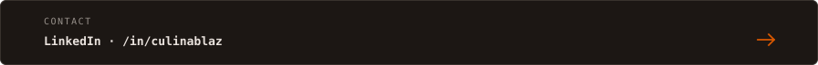

<a href="#gh-light-mode-only">
  <picture>
    <source media="(prefers-color-scheme: dark)" srcset="assets/blank.svg">
    <source media="(max-width: 491px), (min-width: 768px) and (max-width: 794px)" srcset="assets/page-narrow-light.svg">
    <source media="(max-width: 681px), (min-width: 795px) and (max-width: 984px), (min-width: 1012px) and (max-width: 1048px)" srcset="assets/page-medium-light.svg">
    <source media="(max-width: 767px), (min-width: 985px) and (max-width: 1208px)" srcset="assets/page-wide-light.svg">
    
  </picture>
</a>
<a href="#gh-dark-mode-only">
  <picture>
    <source media="(prefers-color-scheme: light)" srcset="assets/blank.svg">
    <source media="(max-width: 491px), (min-width: 768px) and (max-width: 794px)" srcset="assets/page-narrow-dark.svg">
    <source media="(max-width: 681px), (min-width: 795px) and (max-width: 984px), (min-width: 1012px) and (max-width: 1048px)" srcset="assets/page-medium-dark.svg">
    <source media="(max-width: 767px), (min-width: 985px) and (max-width: 1208px)" srcset="assets/page-wide-dark.svg">
    
  </picture>
</a>

<a href="https://www.linkedin.com/in/culinablaz#gh-light-mode-only">
  <picture>
    <source media="(prefers-color-scheme: dark)" srcset="assets/blank.svg">
    <source media="(max-width: 491px), (min-width: 768px) and (max-width: 794px)" srcset="assets/link-linkedin-narrow-light.svg">
    <source media="(max-width: 681px), (min-width: 795px) and (max-width: 984px), (min-width: 1012px) and (max-width: 1048px)" srcset="assets/link-linkedin-medium-light.svg">
    <source media="(max-width: 767px), (min-width: 985px) and (max-width: 1208px)" srcset="assets/link-linkedin-wide-light.svg">
    
  </picture>
</a>
<a href="https://www.linkedin.com/in/culinablaz#gh-dark-mode-only">
  <picture>
    <source media="(prefers-color-scheme: light)" srcset="assets/blank.svg">
    <source media="(max-width: 491px), (min-width: 768px) and (max-width: 794px)" srcset="assets/link-linkedin-narrow-dark.svg">
    <source media="(max-width: 681px), (min-width: 795px) and (max-width: 984px), (min-width: 1012px) and (max-width: 1048px)" srcset="assets/link-linkedin-medium-dark.svg">
    <source media="(max-width: 767px), (min-width: 985px) and (max-width: 1208px)" srcset="assets/link-linkedin-wide-dark.svg">
    
  </picture>
</a>
